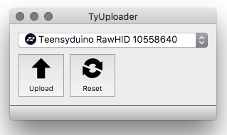

# neotrellis monome compatible grid


## What is it?

Code to use a set of [Adafruit NeoTrellis boards](https://www.adafruit.com/product/3954) as a monome grid clone.

Tested mostly using a Teensy 3.2 microcontroller. 

There is code for using an Adafruit ItsyBitsy M0 (and by extension the Feather M0/M4), but this requires some changes to the underlying libraries (replacing the Adafruit_USBD_Device library deep in the adafruit/arduino core libraries).

Compiled firmwares for Feather M4 and ItsyBitsy M0 are in the repo.

## compatibility

### Max or other computer-based applications

At the time of writing, this code works as expected with the neotrellis-grid connected to a computer with Max running monome patches.

Some people have reported issues with the neotrellis-grid getting recognized by Windows 10. Windows users are advised to install serialosc 1.4.3 and bonjour print services (v2.0.2?).

### ansible / teletype / trilogy modules

2021 updates to ansible / teletype / trilogy modules now support the neotrellis-grid. It should work without modifications.

### norns /norns shield

As of update version 210607 (June 2021) it should be plug and play. Previous versions are unsupported.

###  Fates

For Fates devices this should be fucntional by default on the most recent firmwares.

# Build

## BOM:  

8 [Adafruit NeoTrellis driver boards](https://www.adafruit.com/product/3954) [alt [Mouser](https://www.mouser.com/ProductDetail/485-3954) | [Digikey](https://www.digikey.com/products/en?keywords=1528-2712-ND) ]    

8 [Button keypads](http://www.adafruit.com/product/1611) [alt [Mouser](https://www.mouser.com/ProductDetail/485-1611) | [Digikey](https://www.digikey.com/products/en?keywords=1528-1559-ND) ]    

1 [Adafruit micro B USB Breakout](http://www.adafruit.com/product/1611) [alt [Mouser](https://www.mouser.com/ProductDetail/485-1833) | [Digikey](https://www.digikey.com/products/en?keywords=1528-1383-ND) ]    

1 [Teensy 3.2](https://www.pjrc.com/store/teensy32.html) [alt [Adafruit](https://www.adafruit.com/product/2756) ]  

### optional

1 [Adafruit STEMMA/JST-PH 4-pin cable](https://www.adafruit.com/product/3568) - for testing inndividual neotrellis boards before assembly. Cut the cable in half and wire to the appropriate pins on a Teensy or other microcontroller (VIN, GND, SCL, SDA). See the neotrellis boards themselves for the pin-out.

Standard pin headers - 10 1x5 pin headers can be used for joining the neotrellis boards together. [See video](https://www.youtube.com/watch?v=petILmGcNwQ)

Flexible PCB Carrier (Flexi PCB) for mounting the teensy to the neotrellis boards. [For sale here](https://denki-oto.weebly.com/store/p45/Flexible_PCB_Carrier_for_Neotrellis_Grid.html#/)

## before building

* Test each neotrellis board individually using the Adafruit examples in the `File>Examples>Adafruit seesaw Library>Neotrellis` menu. The Basic sketch is good for testing individual boards. The `multitrellis>basic` sketch is good once you have all the boards connected and addresses assigned.


## neotrellis building

* Review the [Adafruit tutorial on the neotrellis](https://learn.adafruit.com/adafruit-neotrellis/arduino-code) boards. 

* [see this video](https://www.youtube.com/watch?v=petILmGcNwQ) for an example of how to join the boards together

## neotrellis address assignment

* [see this graphic](neotrellis_addresses.jpg) for a default layout of addresses and jumper positions for 8 neotrellis boards.

* new default address order in the code for 16x8 layout (__NOTE__ the address are in reverse order in the code - as compared to the graphic above):  
```
  { Adafruit_NeoTrellis(0x32), Adafruit_NeoTrellis(0x30), Adafruit_NeoTrellis(0x2F), Adafruit_NeoTrellis(0x2E)}, // top row
  { Adafruit_NeoTrellis(0x33), Adafruit_NeoTrellis(0x31), Adafruit_NeoTrellis(0x3E), Adafruit_NeoTrellis(0x36) } // bottom row
```

* see this [neotrellis i2c address chart](NeoTrellis_Addresses.txt) if you want to define your own addresses

* Don't worry about the INT pin - it's not used in the grid software.

## firmware flashing

### Load pre-compiled firmware w/ TyUploader

Get the firmware "hex" file from directory in this repo (download the entire repo ZIP file - not just individual files).

Get TyTools [from GitHub here](https://github.com/Koromix/tytools/releases). More info here (https://koromix.dev/tytools).

Install TyUploader and open it. Be sure your neotrellis-grid is plugged in. The grid/Teensy should show up in the TyUploader application... or select Teensy or Teensyduino from the pull down menu if needed.



Click the Upload button and select the firmware hex file you want to upload. This should upload the firmware and the neotrellis-grid should reboot. That's it.

### If you want to copile the firmware yourself to make changes, etc...

In Arduino - be sure you have the settings in  `Tools -> USB Type` set to `Serial`

Not critical, but set `Tools -> CPU Speed` to `120 MHz (overclock)`

For reference: [here's a forum post on how to flash Teensy firmware](https://llllllll.co/t/how-to-flash-the-firmware-on-a-teensy-micro-controller/20317)


## troubleshooting / testing 

* Be sure you have the Adafruit Seesaw libraries installed and are up to date (via the Arduino Library Manager)

* Be aware - the multitrellis array will fail to initialize if the addresses are wrong, or the wrong number of boards are attached.

* There are Teensy specific i2c_t3 example sketches which can be used to double check your i2c addresses. See `File>Examples>i2c_t3>basic_scanner` for more.

* use [multitrellis_test](multitrellis_test/multitrellis_test.ino) sketch to test fully assembled grid before flashing neotrellis_monome_teensy.

## build help / support / troubleshooting

[see this thread](https://llllllll.co/t/diy-monome-compatible-grid-w-adafruit-neotrellis/28106?u=okyeron) on the lines forum for assistance.

## alternate firmware for color palettes 

https://github.com/oldmanfury/neotrellis-grid-paletted

## norns shield / norns

Update your norns to version 220129 or newer


## testing with serialosc on MacOS

If you already have serialosc installed/running, you may need to unload serialosc to get arduino to properly flash the teensy, then load serialosc to get Max to recognize the grid.  

`launchctl unload /Library/LaunchAgents/org.monome.serialosc.plist`  
`launchctl load /Library/LaunchAgents/org.monome.serialosc.plist`  

Max apps for testing:  
[Monome Home](https://github.com/monome-community/monome-home)  
[test-grid](https://github.com/monome/serialosc.maxpat)  


# Case / Enclosure

[Work in progress](<enclosure/README.md>)


# references

### mext / monome serial protocol

The mext protocol is used for serial communication - same as what is used in most recent monome devices.

### serialosc / libmonome

`serialosc` is required for serial communication with MacOS/Windows computers and OSC devices. Linux may use `serialosc` or `libmonome` depending on the application. `libmonome` is basically driver code which also facillitates monome serial communication.

You can get both `serialosc` and `libmonome` code from [monome github page](https://github.com/monome), and building them is well documented on official linux docs (they work for macOS as well), read part *2 Preparing your system: serialosc* (ignoring the `sudo apt-get` - I was missing `liblo`, but it's available on homebrew): [monome.org/docs/linux/](https://monome.org/docs/linux/).


