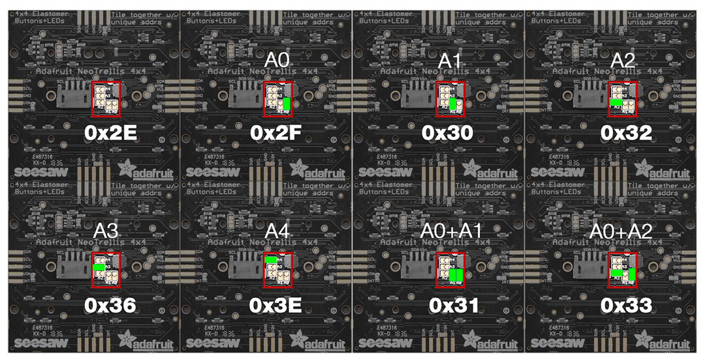

# neotrellis monome grid with teensy 3.2

## hex files

The hex files here are setup with the following addresses:

```
// 16x8 
Adafruit_NeoTrellis trellis_array[NUM_ROWS / 4][NUM_COLS / 4] = {
  { Adafruit_NeoTrellis(0x32), Adafruit_NeoTrellis(0x30), Adafruit_NeoTrellis(0x2F), Adafruit_NeoTrellis(0x2E)}, // top row
  { Adafruit_NeoTrellis(0x33), Adafruit_NeoTrellis(0x31), Adafruit_NeoTrellis(0x3E), Adafruit_NeoTrellis(0x36) } // bottom row
};
```

```
// 8x8 setup
Adafruit_NeoTrellis trellis_array[NUM_ROWS / 4][NUM_COLS / 4] = {
	{ Adafruit_NeoTrellis(0x2F), Adafruit_NeoTrellis(0x2E) },
	{ Adafruit_NeoTrellis(0x3E), Adafruit_NeoTrellis(0x36) }
};
```

These are in order right to left as you look at the BACK of the grid. So from the front/grid side, these will be flipped.

* see this graphic for a default layout of addresses and jumper positions for 8 neotrellis boards (16x8 layout). For an 8x8 just use the left half.  


